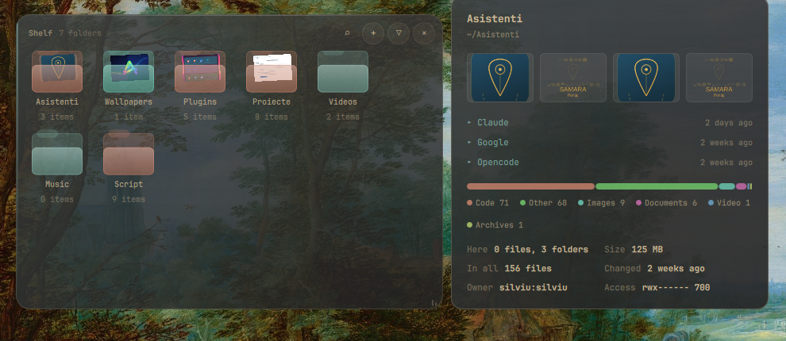

# Folder Shelf

A pane of glass on your desktop holding the folders you actually use. Rest the
pointer on one and you can see inside it — what is in there, how big it is,
when it last changed — without opening anything.



## What it does

The shelf sits **on the desktop**, under your windows, the way a desktop widget
should: it is there when you clear the screen and out of the way when you do
not. One click on the bar icon lifts it above everything while you use it, and
another puts it back down.

Hover a folder and a card opens beside the shelf with:

- **thumbnails** of the pictures inside it, if it has any
- the **most recently changed** entries, with their size and when they changed
- **how much is in there** — entries at the top level, files in the whole tree,
  total size on disk
- a **breakdown by type** — images, video, audio, documents, code, archives —
  as a bar and a legend
- **when it last changed**, and its **owner and permissions**

Then:

| Gesture | What happens |
|---|---|
| **Double click** | Opens the folder in your default file manager |
| **Middle click** | Opens a terminal in that folder |
| **Right click** | Rename it, copy its path, open it, or take it off the shelf |
| **Drag a folder** | Reorders the shelf |
| **Drag the header** | Moves the shelf anywhere on the screen |
| **Drag the corner** | Resizes it |

Add folders with the **+** button, or drop them straight onto the shelf from
your file manager. On its first run the shelf offers the XDG folders you
actually have — Downloads, Documents, Pictures and the rest.

### Where it appears

The shelf is on **every workspace**, always — it is a layer-shell surface, which
belongs to a monitor rather than to a workspace, the same reason the bar does
not vanish when you switch. By default it is on **one** monitor: the one you
left it on, or the first one if that monitor has been unplugged. Turn on **Show
on every monitor** and each screen gets its own, at the same place, sharing the
same folders — hovers, previews and menus stay local to the screen you are
pointing at.

The position, the size, the monitor and the folders are kept in
`~/.config/omarchy/folder-shelf.json`, which is plain JSON you can edit, copy to
another machine, or keep in a dotfiles repo.

## Requirements

| | |
|---|---|
| **Omarchy** | 4.x (the Quickshell `omarchy-shell`) |
| **Commands** | `find`, `stat`, `sort`, `awk`, `timeout` — coreutils, findutils, gawk; already on every Omarchy install |
| **File manager** | Whatever `xdg-open` opens a directory with |
| **Terminal** | Whatever `xdg-terminal-exec` starts — the one `omarchy default terminal` sets |

No daemon, no extra packages, nothing to install.

## Install

```bash
omarchy plugin add https://github.com/samara-hub-ro/samara-folder-shelf.git
omarchy plugin enable samara-hub-ro.folder-shelf right
omarchy restart shell
```

The shelf appears on the desktop, and a shelf icon appears on the right of the
bar. **Keep the bar icon**: it is where the shell stores this plugin's settings,
so with no icon on the bar the shelf runs on its defaults and there is nowhere
to change them. It is also the switch — left click hides and shows the shelf,
right click lifts it above your windows.

### Frosted glass

The shelf is translucent on its own. For the blur behind it, Hyprland has to
have blur turned on and be told these surfaces want it. In
`~/.config/hypr/hyprland.conf`:

```
decoration {
    blur {
        enabled = true
    }
}

layerrule = blur, omarchy-folder-shelf
layerrule = ignorealpha 0.1, omarchy-folder-shelf
layerrule = blur, omarchy-folder-shelf-preview
layerrule = blur, omarchy-folder-shelf-modal
```

Without `decoration:blur:enabled` the `layerrule` lines do nothing, which is the
usual reason the shelf looks flat rather than frosted.

### A keybinding

The shelf answers on IPC, so any key can reach it:

```
bind = SUPER, D, exec, qs -p /usr/share/omarchy/shell ipc call folderShelf toggle
```

`toggle`, `show`, `hide`, `raise`, `lower` and `refresh` are all available.
`refresh` throws away the cached folder statistics and reads them again.

## Settings

Right click the bar icon in Omarchy's bar settings, or edit the widget's entry
in `~/.config/omarchy/shell.json`.

| Setting | Default | What it does |
|---|---|---|
| Layout | Grid | Tiles with the name underneath, or rows with the numbers already on them |
| Tile size | 64 | Size of a folder tile in grid layout |
| Show folder names | on | Names under the tiles |
| Background opacity | 80% | How solid the glass is |
| Preview on hover | on | Open the preview card at all |
| Preview delay | 320 ms | How long the pointer has to rest before it opens |
| Thumbnails | 4 | How many pictures the preview shows |
| Recent entries | 6 | How many recently changed entries it lists |
| Read the whole tree | on | Walk the folder recursively for size and type totals. Off reads only the top level, which is instant on very large folders |
| Scan timeout | 12 s | How long a recursive walk may run before the preview settles for what it read |
| Show on every monitor | off | One shelf per screen instead of one on the screen it was left on |
| Lock in place | off | Stops the shelf being moved or resized by dragging |
| Fill the shelf on first use | on | Offer your XDG folders the first time it opens empty |
| Bar icon | drawn mark | Any glyph your bar font carries |
| Shelf file | `~/.config/omarchy/folder-shelf.json` | Where the folders and the position are kept |

The shelf file is written atomically and never through a symbolic link: every
directory on its path has to be a real directory owned by you or by root, and
the one it sits in has to be yours and writable only by you. A path that fails
that is left alone and the reason is logged, rather than the write landing
wherever a link points.

### About very large folders

Reading a folder means walking it, and a folder with a hundred thousand files in
it takes as long as it takes. The shelf handles that in three ways: the walk runs
in the background and never blocks the shelf, results are cached so a slow folder
is only slow once, and a walk that hits the timeout reports what it managed to
read with a `+` on the size rather than showing nothing. If you keep something
enormous on the shelf and would rather not wait at all, turn **Read the whole
tree** off — the top-level counts are instant.

## Remove

```bash
omarchy plugin disable samara-hub-ro.folder-shelf
omarchy plugin remove samara-hub-ro.folder-shelf --yes
omarchy restart shell
```

That takes the widget off the bar and deletes the plugin. Your folder list is
kept, so reinstalling brings the same shelf back; delete it too with:

```bash
rm ~/.config/omarchy/folder-shelf.json
```

If you added the `layerrule` lines above, remove them from
`~/.config/hypr/hyprland.conf` as well.

## Licence

MIT. See [LICENSE](LICENSE).
